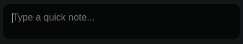
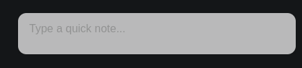

# Togen

A Spotlight‑like quick‑note utility for Electron. Press **Ctrl + `** (backtick) to pop up a dark, semi‑transparent note window where you can type, copy, and paste text. The window hides when it loses focus or when you press **Escape**.

 <!-- add a screenshot later -->

## Features

- Global shortcut **Ctrl + `** to show/hide the note window.
- Dark, semi‑transparent background with light text (Spotlight‑style).
- Copy (**Ctrl + C**) and paste (**Ctrl + V**) via system clipboard.
- Hides on blur (click outside) or **Escape** key.
- No dock/tray icon – runs completely in the background.
- Built with Electron, modern JavaScript, and a preload script for secure IPC.
- Slots: There are 3 slots where 2 and 3 are persistent and 1 is temporary
- Light/Dark Mode
- Demo To try it out [Here](https://melodelete.github.io/Togen/)
# Installation
1. Install AppImage from [releases](https://github.com/melodelete/Togen/releases)
2. Grant Permissions To Run
3. Run AppImage

## Usage
- Press **Ctrl + `** (backtick) to toggle the note window.
- Type your note inside the textarea.
- Use **Ctrl + C** to copy selected text to the clipboard.
- Use **Ctrl + V** to paste clipboard contents at the cursor.
- Click outside the window or press **Escape** to hide it.
- **Ctrl+1/2/3** To Change Slots
- **Ctrl+L/D** To change theme
- **Ctrl+S** To save note as text file
## Development
1. **Clone** this repository.
2. Navigate to the project folder:
   ```bash
   cd path/to/togen
   ```
3. Install Electron (dev dependency):
   ```bash
   npm install
### Project Structure

```
quick-note-electron/
├── main.js          # Electron main process (window creation, shortcut, IPC)
├── preload.js       # Secure bridge to renderer (contextIsolation)
├── index.html       # UI – dark textarea
├── package.json     # npm metadata and start script
└── README.md        # This file
```

### Files Overview

- **main.js** – Creates the hidden window, registers the global shortcut, and sets up IPC handlers for clipboard operations.
- **preload.js** – Exposes a safe `electronAPI.clipboard` object to the renderer via `contextBridge`.
- **index.html** – Contains a single `<textarea>` styled to look like macOS Spotlight.
- **package.json** – Defines the start script (`electron .`) and lists Electron as a dev dependency.

### Making Changes

After editing any file, simply restart the app:

```bash
npm start
```

If you want to package the app for distribution, tools like [electron-forge](https://www.electronforge.io/) or [electron-builder](https://www.electron.build/) can be used.

## License

MIT © MeloDelete

Feel free to modify and redistribute as you wish.

## TODO / Ideas
E for Electron App Only (Not a demo feature)
- Persistent Notes (Auto-save / Restore)
- ~~Multiple Notes / Slots~~
- ~~Theme Switcher (Light / Dark / System)~~
- Pin Note to Screen Edge
- Quick-Insert Snippets
- Sound / Visual Feedback
- Tray / Menu Bar Icon (Optional)
- Settings Window
- Drag-to-Move
- ~~Save as Text (S)~~
- Integration with Other Apps
- Secure / Encrypted Notes (Optional)
- Automatic Timestamp Header
- ~~OS support~~
--- 

Enjoy your quick‑note utility!
